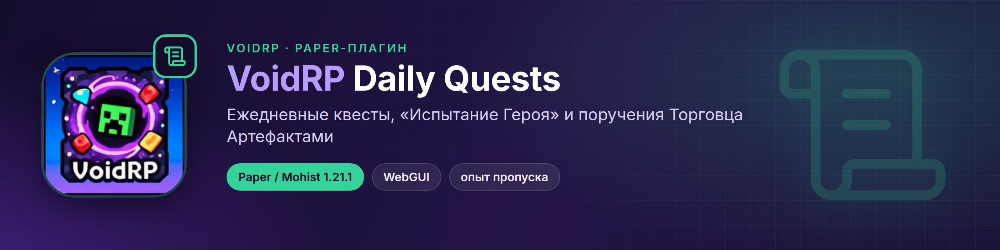
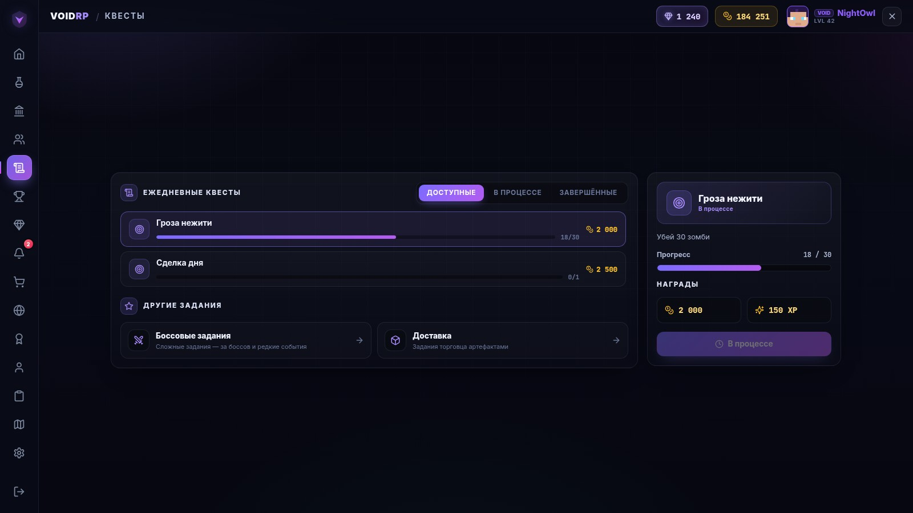
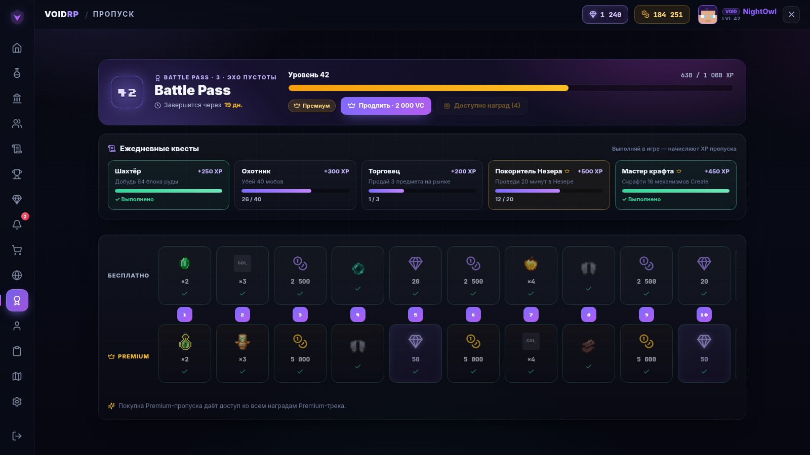
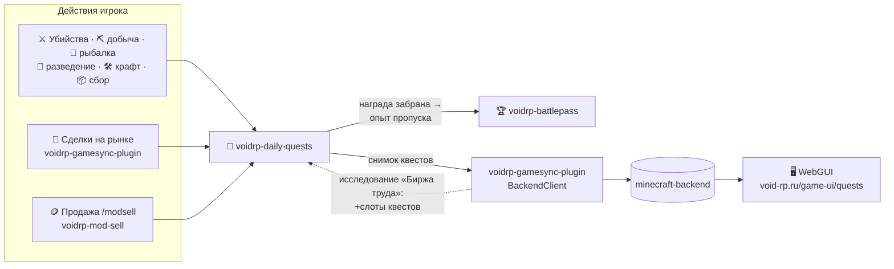
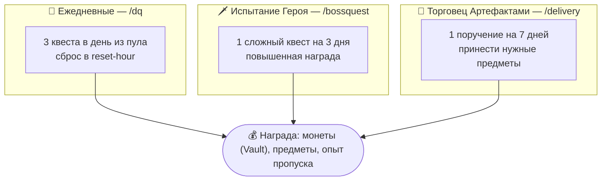

<p align="center"></p>

<div align="center">


[](https://github.com/VOIDRP-MINECRAFT/voidrp-daily-quests/actions/workflows/build.yml)


</div>

> Paper-плагин заданий VoidRP: три ежедневных квеста, трёхдневное «Испытание Героя» и недельные
> поручения Торговца Артефактами. Прогресс виден в WebGUI, выполненные квесты дают опыт боевого пропуска.

---

## 📸 Как это выглядит

<table>
<tr>
<td width="50%"><br><sub>Ежедневные квесты в WebGUI</sub></td>
<td width="50%"><br><sub>Задания дня в боевом пропуске</sub></td>
</tr>
</table>

<sub>Страницы [voidrp-site](https://github.com/VOIDRP-MINECRAFT/voidrp-site) на демо-данных; в игре открываются через WebGUI.</sub>

---

## 🗺️ Место в экосистеме



---

## ✨ Три вида заданий



- **Типы целей:** `KILL`, `COLLECT`, `MINE`, `FISH`, `BREED`, `CRAFT`, `MARKET_SELL`, `MARKET_BUY`
  и продажи через `/modsell`.
- **Бонус нации:** исследование «Биржа труда» даёт дополнительные слоты ежедневных квестов.
- **Трекер:** `/questtrack` закрепляет активный квест на экране.
- **NPC:** «Квестодатель» открывает ежедневные квесты, «Торговец Артефактами» — поручения
  (или команда через CitizensCMD: `/npc command add -p dailyquest`).
- **WebGUI:** при `webgui.enabled: true` `/dq` открывает страницу квестов поверх игры.

---

## ⌨️ Команды

| Команда | Кому | Что делает |
|---|---|---|
| `/dailyquest` (`/dq`, `/quests`, `/квесты`) | игрок | Ежедневные квесты |
| `/bossquest` (`/bq`, `/испытание`) | игрок | Испытание Героя |
| `/delivery` (`/del`, `/торговец`) | игрок | Поручение Торговца Артефактами |
| `/questtrack` (`/qt`, `/track`) | игрок | Закрепить/открепить квест на экране |
| `/dqadmin reset\|info <игрок>` | `voidrp.dailyquests.admin` | Администрирование ежедневных квестов |
| `/bqadmin reset\|info <игрок>` | `voidrp.dailyquests.admin` | Администрирование испытаний |

---

## 📋 Требования

| Компонент | Версия |
|---|---|
| Paper / Mohist | 1.21.1 |
| Java | 21 |
| Vault, VoidRpGameSync, VoidRpModSell, VoidRpBattlePass | soft-depend |

---

## 🚀 Сборка

Плагин компилируется против собранных jar `voidrp-gamesync-plugin` и `voidrp-mod-sell`, поэтому
репозитории кладутся рядом — так же делает CI:

```bash
git clone https://github.com/VOIDRP-MINECRAFT/voidrp-gamesync-plugin voidrp_gamesync_plugin
git clone https://github.com/VOIDRP-MINECRAFT/voidrp-mod-sell voidrp_mod_sell
git clone https://github.com/VOIDRP-MINECRAFT/voidrp-daily-quests voidrp_daily_quests
(cd voidrp_gamesync_plugin && ./gradlew shadowJar)
(cd voidrp_mod_sell && ./gradlew shadowJar)
(cd voidrp_daily_quests && ./gradlew build)
```

---

## ⚙️ Конфигурация

`plugins/VoidRpDailyQuests/config.yml`:

```yaml
quests-per-day: 3
reset-hour: 0                 # час сброса по времени сервера
reward-multiplier: 1.0        # множитель наград в монетах и опыте
npc-names:
  - "§6Квестодатель"
delivery-npc-names:
  - "§5Торговец Артефактами"
webgui:
  enabled: false
  quests-url: "https://void-rp.ru/game-ui/quests"
```

---

## 🔗 Связанные репозитории

| Репо | Связь |
|---|---|
| [voidrp-battlepass](https://github.com/VOIDRP-MINECRAFT/voidrp-battlepass) | Опыт пропуска за каждую забранную награду (`BattlePassHooks.onDailyQuestClaim / onBossQuestClaim / onDeliveryQuestClaim`) |
| [voidrp-gamesync-plugin](https://github.com/VOIDRP-MINECRAFT/voidrp-gamesync-plugin) | Сделки на рынке, исследования наций, отправка снимка квестов на бэкенд |
| [voidrp-mod-sell](https://github.com/VOIDRP-MINECRAFT/voidrp-mod-sell) | Продажи модовых предметов засчитываются в квесты |
| [voidrp-site](https://github.com/VOIDRP-MINECRAFT/voidrp-site) | Страница `/game-ui/quests` |

---

<div align="center">
<a href="https://void-rp.ru">🌐 Сайт</a> ·
<a href="https://github.com/VOIDRP-MINECRAFT">🏠 Организация</a>
</div>
